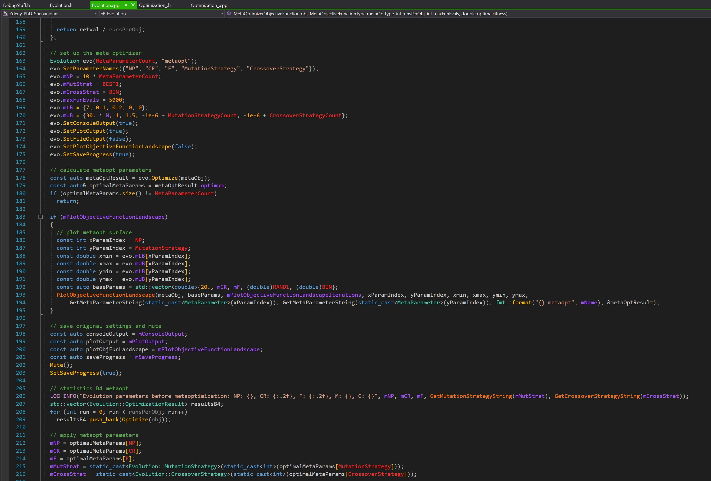

# Visual Studio & Visual Studio Code colorful environment
VS & VSCode dark but colorful settings. Distinguishes functions, member functions, static functions, local variables, member variables, static variables, global variables, macros, preprocessor directives, function parameters, operators, overloaded operators, enums, lambdas, ...

## Visual Studio Code Theme
- Install vscode theme https://marketplace.visualstudio.com/items?itemName=tanmay.discord-theme
- Download cascadia code font from https://github.com/microsoft/cascadia-code/releases
- Update your `settings.json` from `VisualStudioCode/settings.json` - mainly the following fields
  - `workbench.colorTheme`
  - `workbench.colorCustomizations`
  - `editor.fontFamily`
  - `editor.semanticTokenColorCustomizations` 
  - `editor.tokenColorCustomizations`

## Linux Terminal Theme
- `sudo apt-get install zsh`
- `sh -c "$(curl -fsSL https://raw.githubusercontent.com/ohmyzsh/ohmyzsh/master/tools/install.sh)"`
- Install fonts & follow instructions for Visual Studio Code (& Windows Terminal): https://github.com/romkatv/powerlevel10k#meslo-nerd-font-patched-for-powerlevel10k Fonts -> Manual font installation
- `git clone --depth=1 https://github.com/romkatv/powerlevel10k.git ${ZSH_CUSTOM:-$HOME/.oh-my-zsh/custom}/themes/powerlevel10k`
- add `ZSH_THEME="powerlevel10k/powerlevel10k"` to `~/.zshrc`
- `p10k configure`
- add `plugins=(git zsh-autosuggestions zsh-syntax-highlighting)` to `~/.zshrc`
- `git clone https://github.com/zsh-users/zsh-syntax-highlighting.git ${ZSH_CUSTOM:-~/.oh-my-zsh/custom}/plugins/zsh-syntax-highlighting`
- `git clone https://github.com/zsh-users/zsh-autosuggestions ${ZSH_CUSTOM:-~/.oh-my-zsh/custom}/plugins/zsh-autosuggestions`

## Linux C++ dev environment
- `sudo apt update`
- `sudo apt -y upgrade`
- `sudo apt -y install build-essential`
- `sudo apt-get install gdb`
- `sudo apt -y install clang-format`
- `git config --global user.email "xxxx@xxx.com"`
- `git config --global user.name "xxxx"`

## Visual Studio Theme
- Install the Color Theme Editor/Designer extension
  - Visual Studio 2017: https://marketplace.visualstudio.com/items?itemName=VisualStudioPlatformTeam.VisualStudio2017ColorThemeEditor
  - Visual Studio 2019: https://marketplace.visualstudio.com/items?itemName=ms-madsk.ColorThemeDesigner
  - Visual Studio 2022: https://marketplace.visualstudio.com/items?itemName=idex.colorthemedesigner2022
- VisualStudio > Tools > Customize Colors > Import Theme > select the theme `VisualStudio/dark_zdeny.vstheme`

## Windows Terminal Theme
- install Windows Terminal https://www.microsoft.com/en-us/p/windows-terminal/9n0dx20hk701
- use `WindowsTerminal/settings.json` settings

## Windows C++ dev environment
- install WSL 2 via elevated powershell `wsl --install -d Ubuntu`
- install vscode WSL extension
- follow steps in `Linux C++ dev environment`

