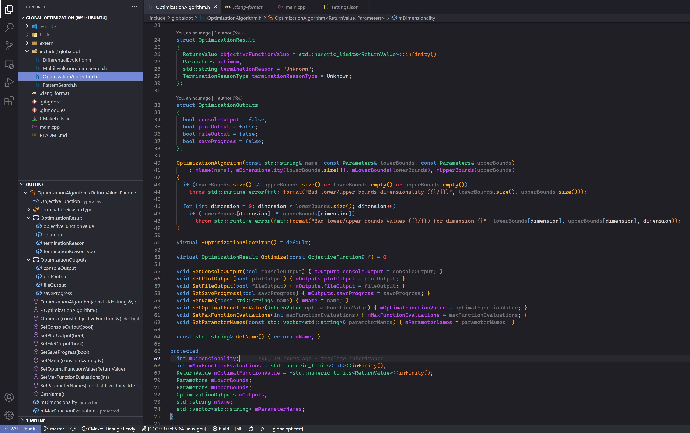
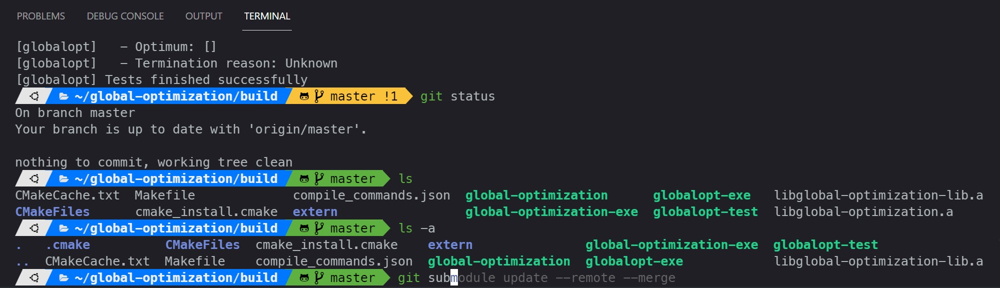

# Visual Studio & Visual Studio Code colorful environment
VS & VSCode dark but colorful settings. Distinguishes member functions, static functions, global functions, member variables, static variables, global variables, macros, preprocessor directives, parameters, operators, etc.

## Visual Studio Code Theme
- Install vscode theme https://marketplace.visualstudio.com/items?itemName=tanmay.discord-theme
- Download cascadia code font from https://github.com/microsoft/cascadia-code/releases
- Update your vscode settings from settings.json

## Linux Terminal Theme
- `sudo apt-get install zsh`
- `sh -c "$(curl -fsSL https://raw.githubusercontent.com/ohmyzsh/ohmyzsh/master/tools/install.sh)"`
- Install fonts & follow instructions for Visual Studio Code (& Windows Terminal): https://github.com/romkatv/powerlevel10k#meslo-nerd-font-patched-for-powerlevel10k Fonts -> Manual font installation
- `git clone --depth=1 https://github.com/romkatv/powerlevel10k.git ${ZSH_CUSTOM:-$HOME/.oh-my-zsh/custom}/themes/powerlevel10k`
- add `ZSH_THEME="powerlevel10k/powerlevel10k"` to `~/.zshrc`
- `p10k configure`
- add `plugins=(git zsh-autosuggestions zsh-syntax-highlighting)` to `~/.zshrc`
- `git clone https://github.com/zsh-users/zsh-syntax-highlighting.git ${ZSH_CUSTOM:-~/.oh-my-zsh/custom}/plugins/zsh-syntax-highlighting`
- `git clone https://github.com/zsh-users/zsh-autosuggestions ${ZSH_CUSTOM:-~/.oh-my-zsh/custom}/plugins/zsh-autosuggestions`

## Windows Terminal Theme
- install Windows Terminal https://www.microsoft.com/en-us/p/windows-terminal/9n0dx20hk701
- use `WindowsTerminal/settings.json` settings

## Windows dev environment
- install WSL 2
- install Ubuntu via Microsoft Store
- install vscode WSL extension

## Linux dev environment
- `sudo apt update`
- `sudo apt -y upgrade`
- `sudo apt -y install build-essential`
- `sudo apt-get install gdb`
- `sudo apt -y install clang-format`
- `git config --global user.email "xxxx@xxx.com"`
- `git config --global user.name "xxxx"`
