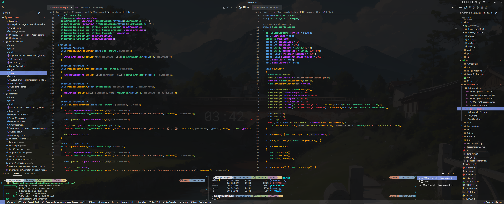

# Visual Studio Code environment
***Dark but colorful*** settings. Distinguishes functions, member functions, static functions, local variables, member variables, static variables, global variables, macros, preprocessor directives, function parameters, operators, overloaded operators, enums, lambdas, ...

- Install vscode theme [**Aura Spirit Dracula Theme (soft)**](https://marketplace.visualstudio.com/items?itemName=JoseMurilloc.aura-spirit-dracula)
- Install [**CaskaydiaCove Nerd Font**](https://github.com/ryanoasis/nerd-fonts/releases)
- Update (merge) your `settings.json` with [`settings.json`](settings.json)
- Terminal:  [**oh-my-posh**](https://github.com/JanDeDobbeleer/oh-my-posh) with [custom profile](nordcustom_v.2.omp.json)

